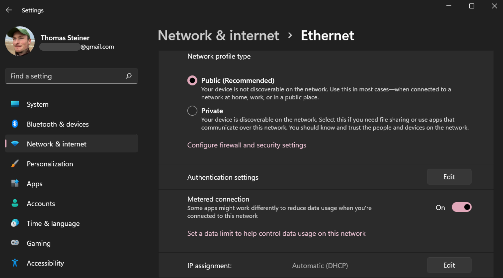
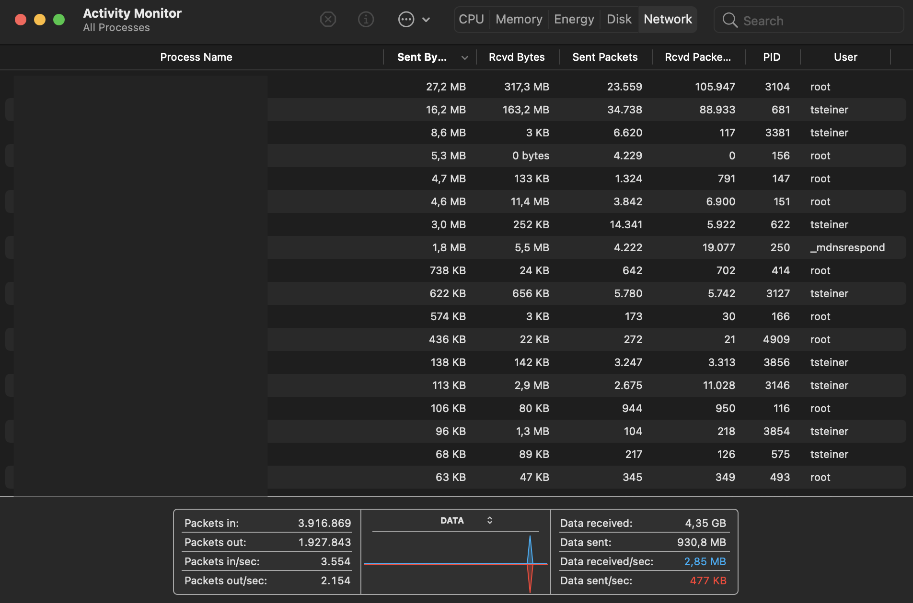
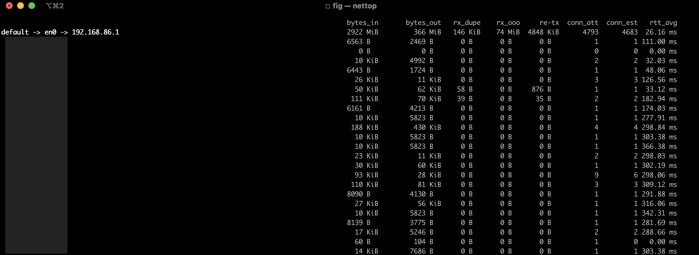

# Network Information API

Thomas Steiner ([tomac@google.com](mailto:tomac@google.com))

## Introduction and background

More and more devices are permanently connected to the Internet, and connectivity is a fundamental
requirement for many. Network connectivity depends on a lot of factors, some of which include the
connection type (e.g., Wi-Fi, 3G, 4G, 5G, etc.), but also factors like the device's physical
location (e.g., Wi-Fi on a moving train), or the user's preferences (e.g., a desire to not overly
tax a data connection shared with others).

Naive assumptions like "connected to Wi-Fi always means connectivity is granted and data is cheap"
or the opposite "connected to cellular always means connectivity is spotty and data is expensive" no
longer hold true, and in many cases never did.

The _Network Information API_ aims to provide a standard approach for web applications to query the
current network status in a meaningful and privacy-preserving way.

### Distinction from the save data use case

Getting information about the network connection is not to be treated as equivalent to a necessary
desire to save data. For example, a web application that downloads data via the BitTorrent protocol
may voluntarily want to limit itself to only a percentage of the available bandwidth as to not block
other browsing activity, but the objective is not saving data.

The save data use case is dealt with in the [Save Data API](https://wicg.github.io/savedata/) spec.
Web developers can also make use of the
[`prefers-reduced-data`](https://www.w3.org/TR/mediaqueries-5/#prefers-reduced-data) user preference
media feature in CSS (`@media (prefers-reduced-data: reduce) { /* … */ }`) or JavaScript
(`if (window.matchMedia('(prefers-reduced-data: reduce)').matches) { /* … */ }`).

## Definitions

### Metered connection

A _metered connection_ is an Internet connection that has a data limit associated with it. Examples
include mobile data plans with a certain amount of included data, but also ad-hoc hotel Wi-Fi
access, or even certain home Internet data plans. Once the data limit is reached, the connection is
interrupted, or continuous data usage is charged at an additional (commonly high) cost. It is
typically the desire of the user to remain within the caps of the data plan, and not be charged for
data usage above the cap.

### Sustained connection speed

The _sustained connection speed_ is a numerical means to express what kind of transfers the current
connection is suitable for.
[Nielsen's Law of Internet Bandwidth](https://www.nngroup.com/articles/law-of-bandwidth/) has shown
that users' bandwidth grows by 50% per year. Therefore, rather than use fixed speed labels like 3G,
4G, or 5G (that might be based on theoretically technically possible maximum bandwidth or
field-measured actual bandwidth) or meaningless labels like Wi-Fi, the _Network Information API_
uses open-ended bandwidth ranges to express the sustained connection speed. These ranges are
measured in <dfn data-lt="BitPerSecond">bit per second</dfn> (bit/s) and can be used in conjunction
with SI prefixes (e.g., 1&nbsp;kbit/s&nbsp;=&nbsp;1,000&nbsp;bit/s,
1&nbsp;Mbit/s&nbsp;=&nbsp;1,000&nbsp;kbit/s, 1&nbsp;Gbit/s&nbsp;=&nbsp;1,000&nbsp;Mbit/s, or
1&nbsp;Tbit/s&nbsp;=&nbsp;1,000&nbsp;Gbit/s). For example, 4K&nbsp;video commonly requires
20&nbsp;Mbp/s sustained speed according to the popular streaming service
[YouTube](https://support.google.com/youtube/answer/78358?hl=en). The means through which the
sustained connection speed is realized (e.g., via a Wi-Fi or an ethernet connection) is not exposed.

## Origin of the data

### Metered connections

Some operating systems let the user declare certain networks as metered networks, which typically
disables features like syncing or automatic updates.

- Windows metered connection:

  

- Android metered connection:

  

### Network statistics

Operating systems like Windows or macOS make realtime network statistics available in their _Task
Manager_ respectively their _Activity Monitor_ apps. On the command line, many operating systems
offer the [`nettop`](https://github.com/Emanem/nettop) tool or other means to obtain network
statistics.

- The Windows _Task Manager_:

  

- The macOS _Activity Monitor_:

  

- The `nettop` tool:

  
